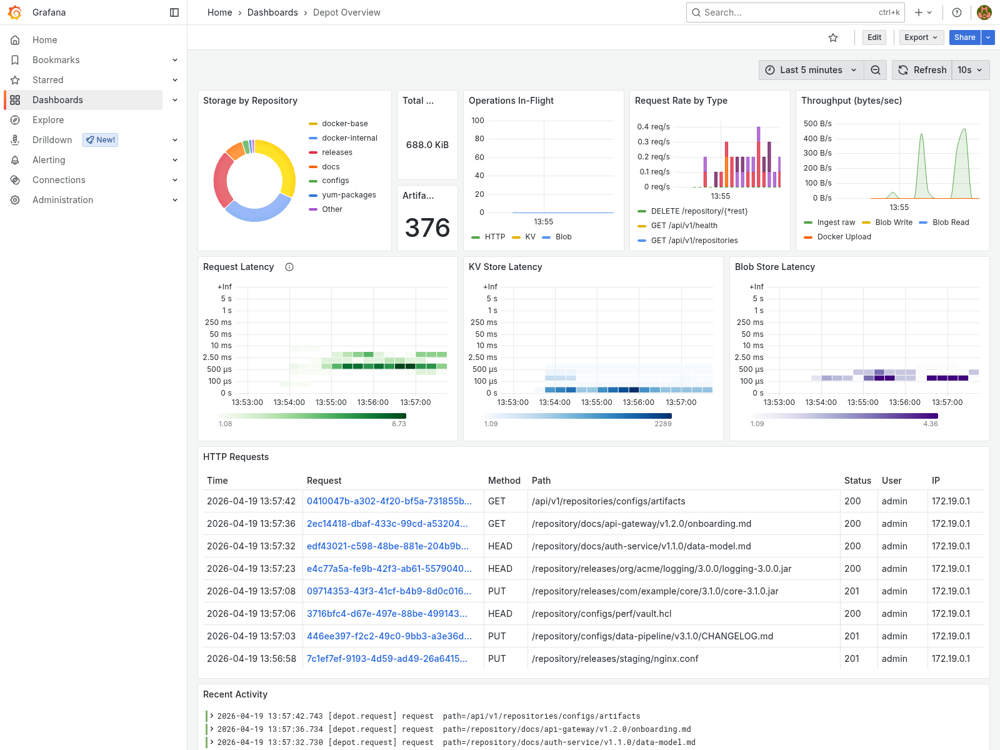
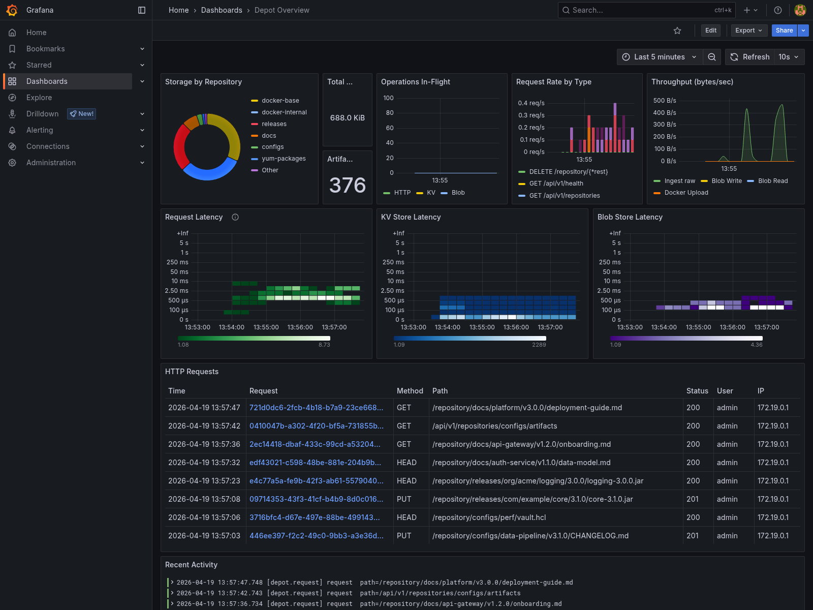
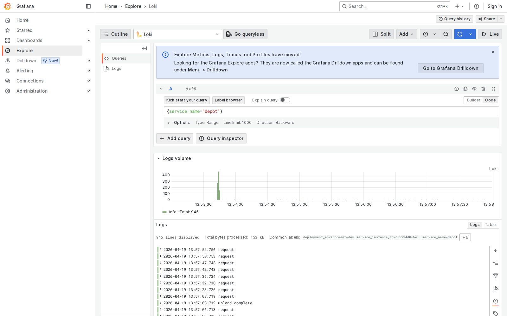
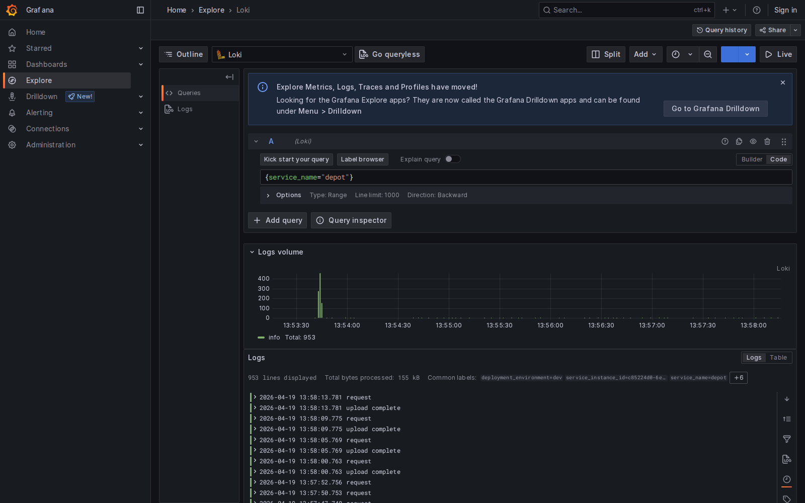
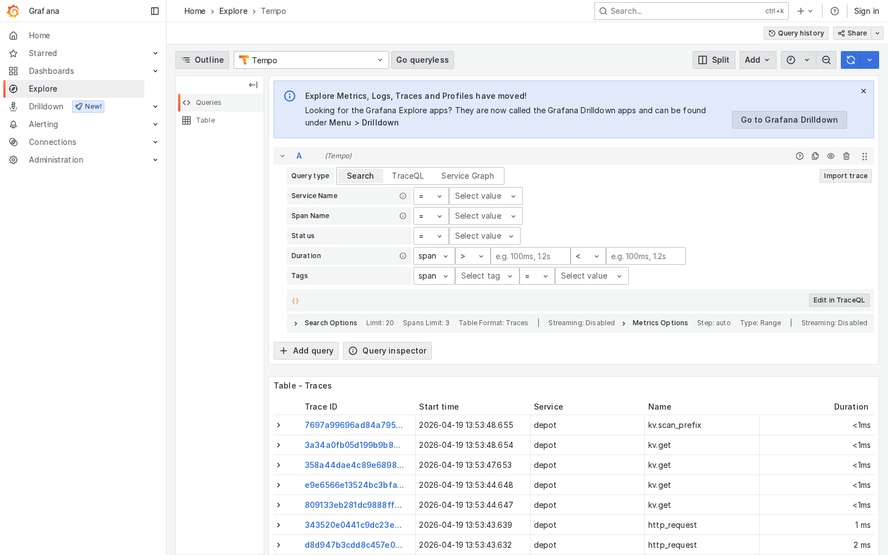
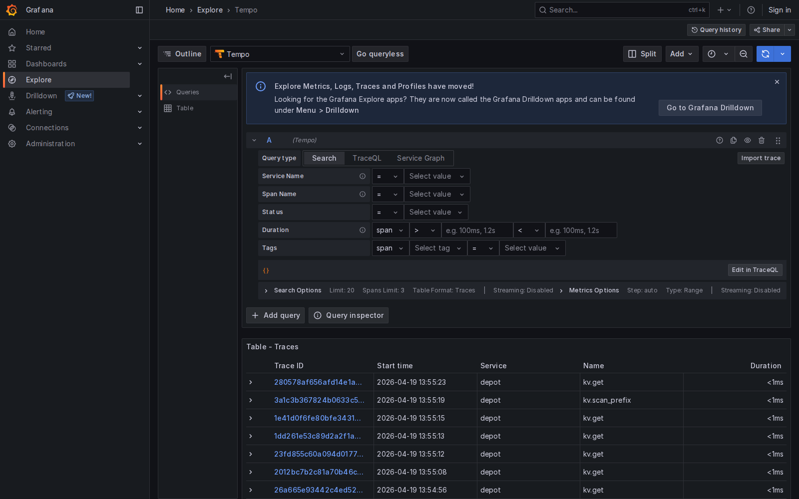

# Observability
{: .no_toc }

Depot emits spans, logs, and metrics on a single OpenTelemetry pipeline,
so any OTel-compatible backend works. The screenshots on this page come
from the bundled `docker/standalone` stack with the `monitoring` profile
active: an otel-collector sidecar fans traces to Tempo, logs to Loki,
and metrics are scraped directly from the depot `/metrics` listener by
Prometheus. Grafana reads all three.

## Depot Overview dashboard

The provisioned `Depot Overview` dashboard is the at-a-glance view. The
top row shows storage breakdown by repository (a donut chart), the
total bytes and total artifact count across the cluster. Below that,
three timeseries panels -- operations in-flight, request rate by type,
and ingest/blob/Docker throughput -- expose load in real time. The
bottom half is a stack of heatmaps: HTTP request latency, KV store
operation latency, and blob store operation latency; points on the HTTP
heatmap link straight into Tempo for trace-level drill-down. A
Loki-sourced table at the bottom shows recent structured request logs
(method, path, status, user, IP, bytes, latency, trace_id) and a free
log stream panel tails depot's `depot.request` target.

  
  

## Loki logs

Depot exports structured log events over OTLP to the collector, which
forwards to Loki. Every HTTP request becomes a log line with method,
path, status, duration, response size, client IP, authenticated user,
and the trace ID associated with the request span. The `service_name`
resource attribute is set by `[tracing] service_name = "depot"`, so
queries like `{service_name="depot"}` pick up the full stream.

  
  

## Tempo traces

Request spans are exported on the same OTel pipeline to Tempo. Each
HTTP request becomes a root span with child spans for every KV
operation (`kv.get`, `kv.put_if_version`, `kv.scan_prefix`, ...) and
every blob store operation (`blob.write`, `blob.read`, `blob.delete`),
so a single trace shows the full waterfall from handler entry down to
the storage backend. TraceQL searches via Grafana's Tempo datasource;
an empty `{}` query lists every recent trace.

  
  

## Plugging in your own backend

The OTel pipeline is first-class, so you aren't stuck with the bundled
Tempo / Loki / Prometheus trio -- point `[tracing].otlp_endpoint` and
`[logging].otlp_endpoint` at any OTLP-compatible collector and choose
what your collector exports to downstream (Jaeger, Honeycomb, Datadog,
SigNoz, AWS X-Ray, Azure Monitor, Splunk, an object store, ...).
Metrics are served in Prometheus format at `/metrics` on the main
listener (or on `metrics_listen` if you want them isolated), so they
plug into any Prometheus-compatible scraper.
