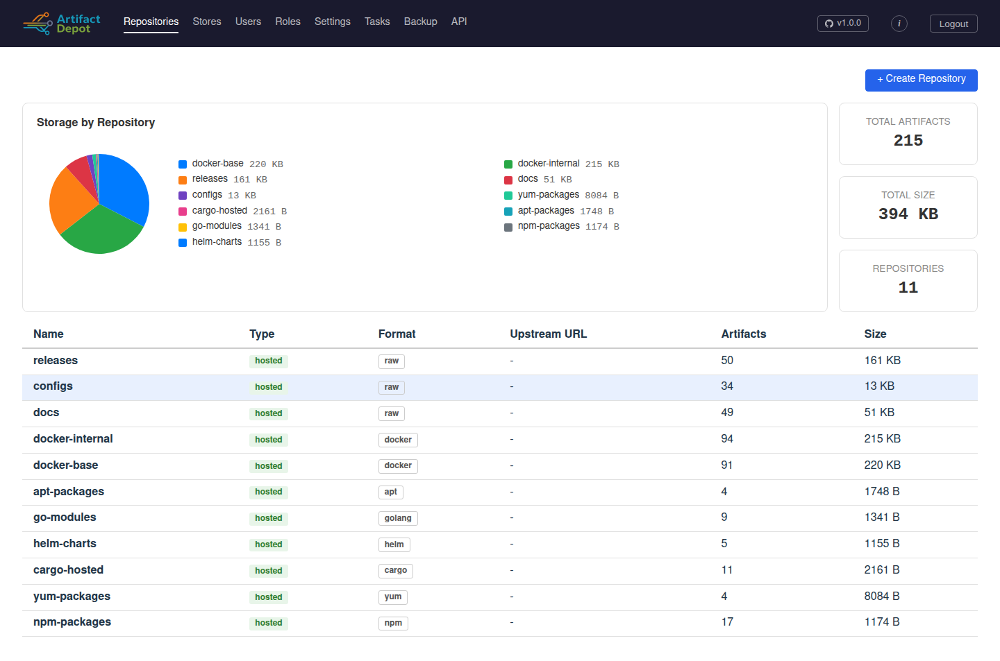
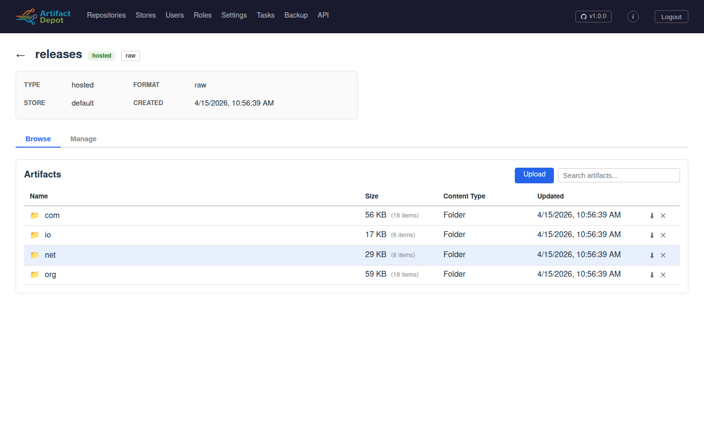
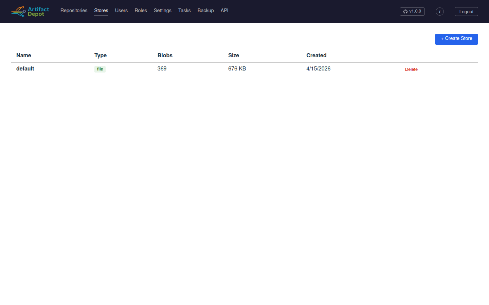
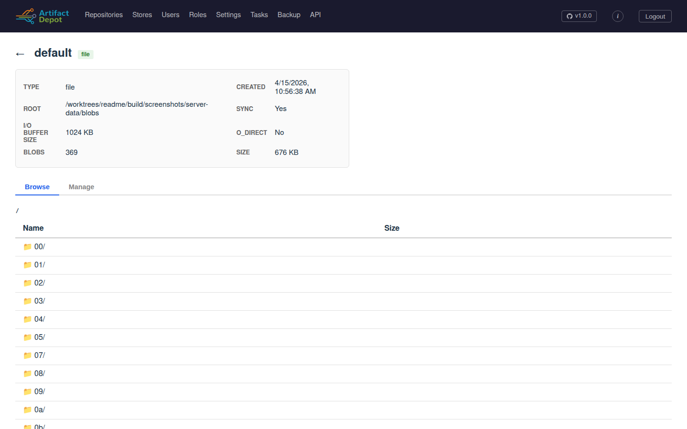
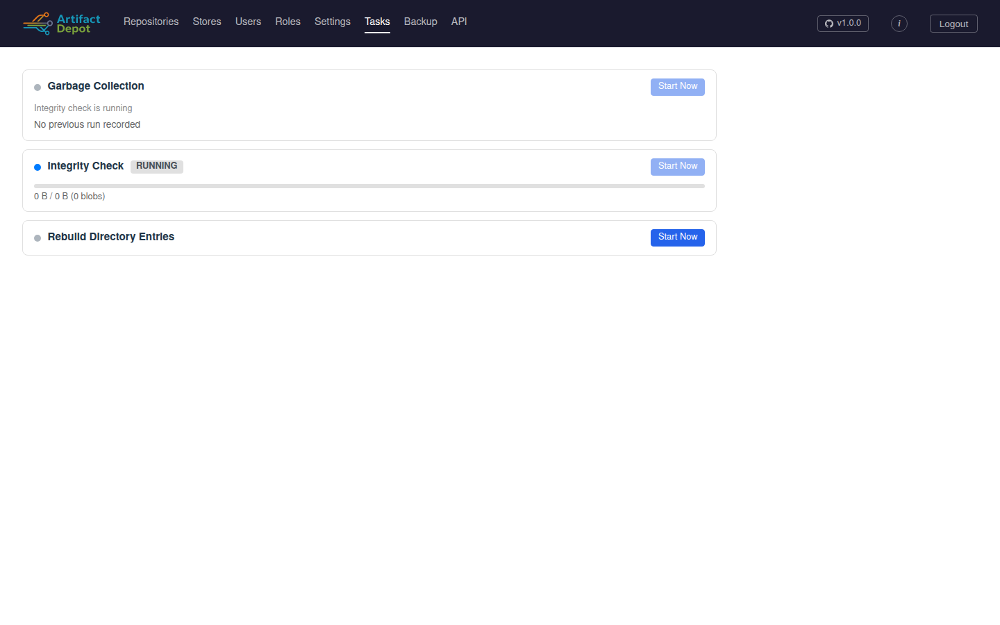
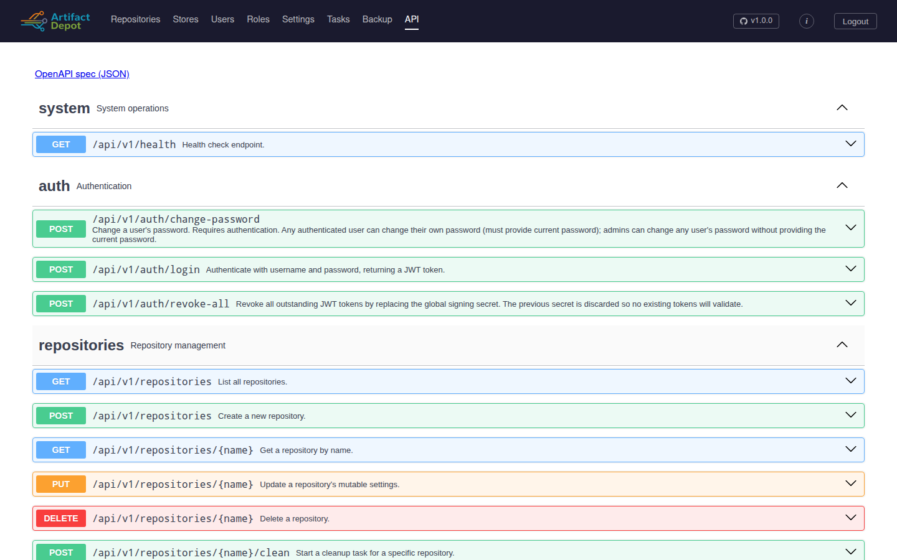

# UI Screenshots
{: .no_toc }

A tour of the embedded Vue UI under realistic load. Each screenshot is
captured by Chromium against a fresh depot instance that's been seeded
with `depot-bench demo` and is being driven by `depot-bench trickle`,
so the artifact counts, store sizes, and progress bars in these images
reflect a working system rather than empty bootstrap state.

To regenerate the images yourself:

```bash
make screenshots
```

The harness (`scripts/screenshots.sh`) boots a depot in an isolated
network namespace, seeds + trickles it, runs the `screenshots`
Playwright project (`ui/frontend/e2e/screenshots.spec.ts`), and copies
the resulting PNGs into this directory.

---

## Repositories

The Repositories page is the dashboard. The header summarises totals
across the cluster (artifact count, on-disk size, repository count) and
breaks the storage footprint down by repository in a pie chart. Every
artifact format -- raw, Docker, APT, Yum, PyPI, npm, Cargo, Helm, Go --
appears in the same flat list with a colour-coded format badge.



## Repository detail (Browse)

Clicking into a repository opens its artifact browser. The tree is
lazy-loaded; the Size column shows aggregated bytes per directory, and
the Updated column reflects last-modified times. Hosted, cache, and
proxy repos all share this layout -- only the top header changes.



## Stores

Blob stores are managed independently from repositories. The list shows
which storage backend each store uses (file or S3), the live blob count
maintained by GC, and the on-disk total.



## Store detail (Browse)

The store detail page exposes the physical content-addressable layout
underneath -- directories are the first two prefix bytes of each
BLAKE3 blob ID, with the actual blob files at the leaves.



## Tasks

The Tasks page lets an operator kick off the singleton background jobs
(Garbage Collection, Integrity Check, Rebuild Directory Entries) and
watch them run. Progress bars stream live byte and blob counts; the
last completed result for each job stays on the page until the next
run.



## Settings

Cluster-wide operational settings live here -- access logging, upload
size limits, GC interval / minimum gap, default Docker repo, CORS,
rate limiting, the logging endpoints (file / OTLP / Splunk HEC), the
tracing endpoint, and JWT lifetimes. Changes are pushed to the
settings handle and propagated to every cluster instance within the
30-second refresh window.


## API documentation

The full OpenAPI spec is rendered in-browser via Swagger UI. Every
endpoint can be expanded to inspect parameters, request bodies,
response schemas, and try-it-now interactively against the live
server.


