# UI Screenshots
{: .no_toc }

## Repositories

The Repositories page is the dashboard. The header summarises totals
across the cluster (artifact count, on-disk size, repository count) and
breaks the storage footprint down by repository in a pie chart. Every
artifact format -- raw, Docker, APT, Yum, PyPI, npm, Cargo, Helm, Go --
appears in the same flat list with a colour-coded format badge.

  <a href="screenshots/repositories-light.png" target="_blank">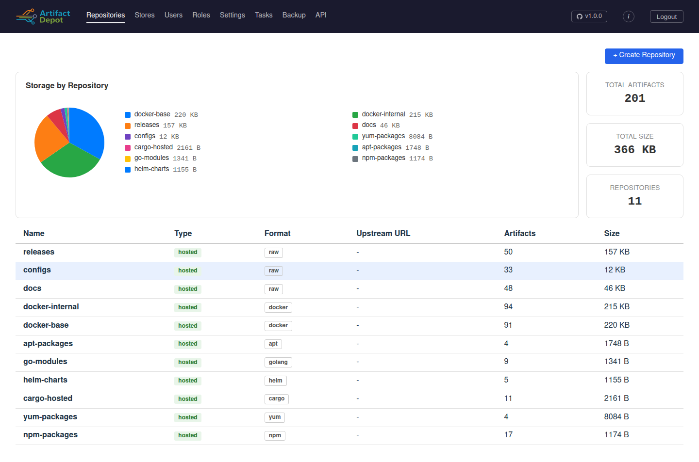</a>
  <a href="screenshots/repositories-dark.png" target="_blank">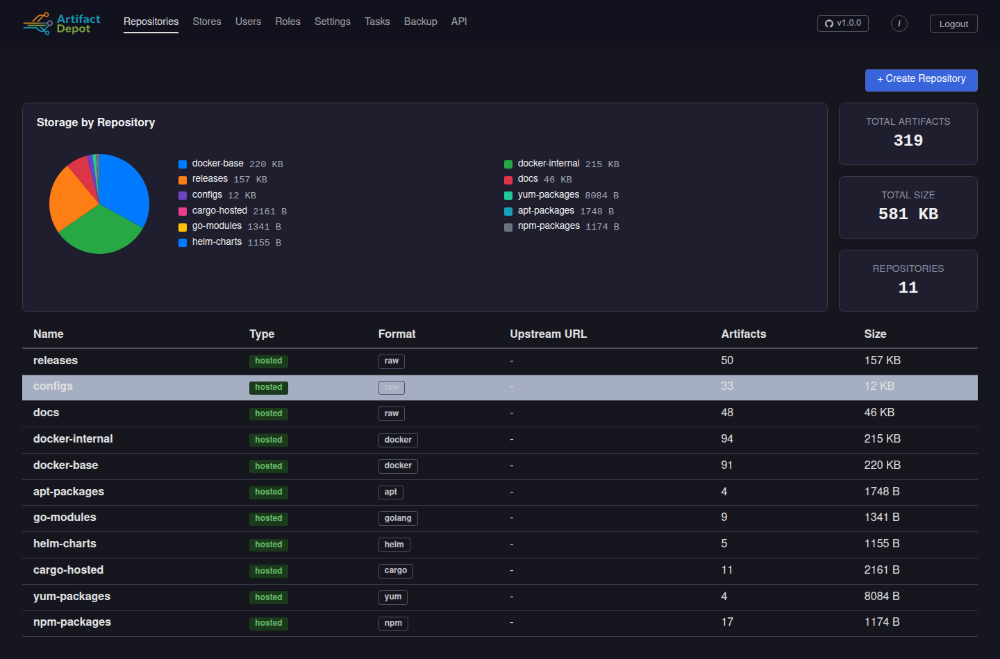</a>

## Repository detail (Browse)

Clicking into a repository opens its artifact browser. The tree is
lazy-loaded; the Size column shows aggregated bytes per directory, and
the Updated column reflects last-modified times. Hosted, cache, and
proxy repos all share this layout -- only the top header changes.

  <a href="screenshots/repository-detail-light.png" target="_blank">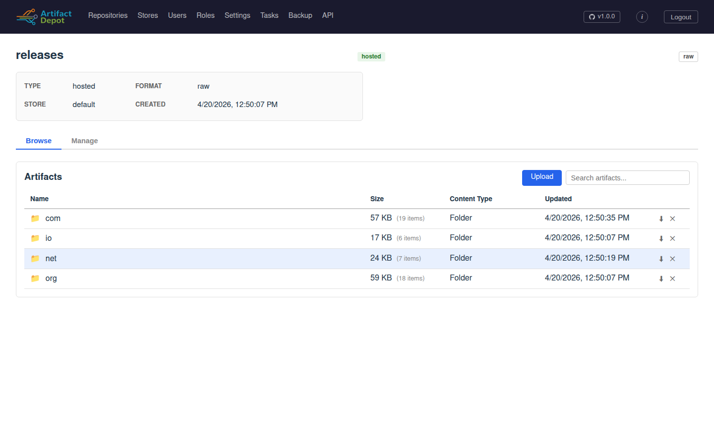</a>
  <a href="screenshots/repository-detail-dark.png" target="_blank">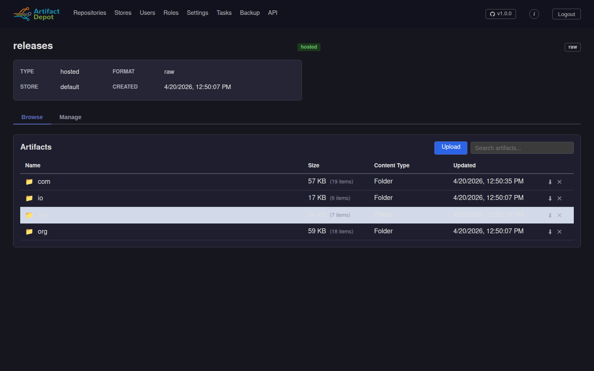</a>

## Stores

Blob stores are managed independently from repositories. The list shows
which storage backend each store uses (file or S3), the live blob count
maintained by GC, and the on-disk total.

  
  <a href="screenshots/stores-dark.png" target="_blank">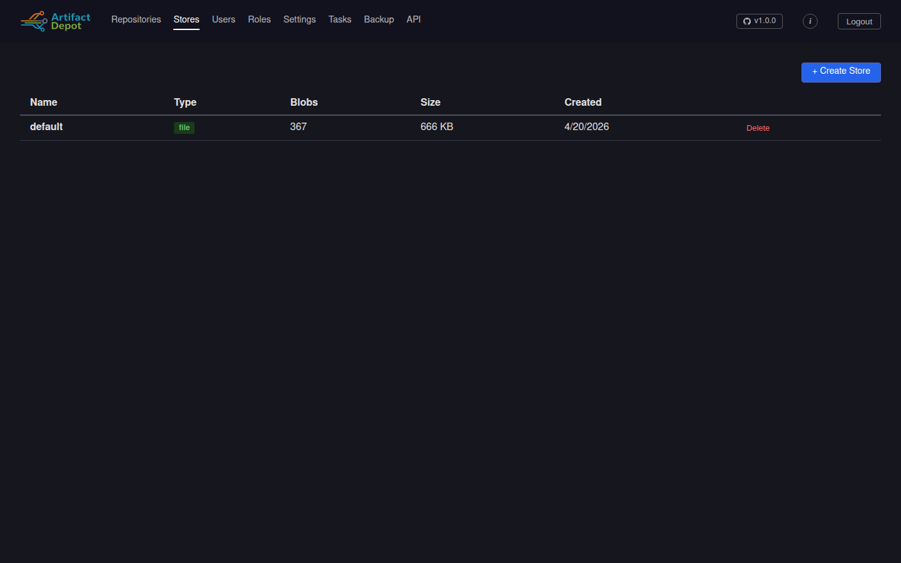</a>

## Store detail (Browse)

The store detail page exposes the physical content-addressable layout
underneath -- directories are the first two prefix bytes of each
BLAKE3 blob ID, with the actual blob files at the leaves.

  <a href="screenshots/store-detail-light.png" target="_blank">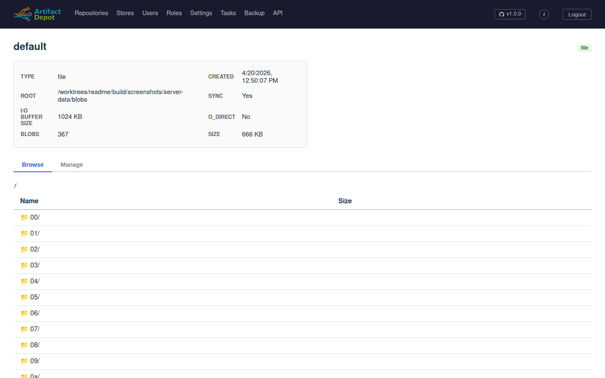</a>
  <a href="screenshots/store-detail-dark.png" target="_blank">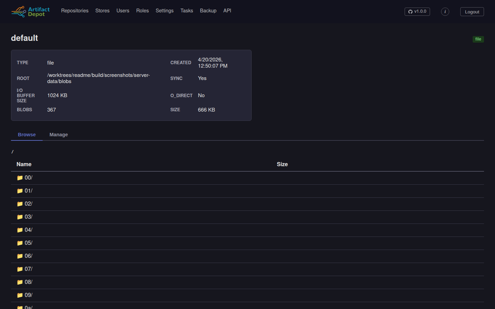</a>

## Tasks

The Tasks page lets an operator kick off the singleton background jobs
(Garbage Collection, Integrity Check, Rebuild Directory Entries) and
watch them run. Progress bars stream live byte and blob counts; the
last completed result for each job stays on the page until the next
run.

  
  <a href="screenshots/tasks-dark.png" target="_blank">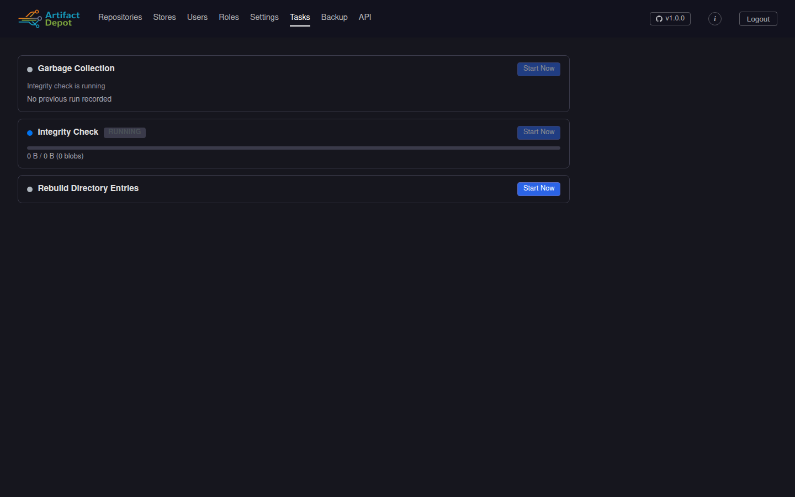</a>

## Settings

Cluster-wide operational settings -- access logging, upload size limits,
GC interval, default Docker repo, CORS, rate limiting, tracing endpoint,
and JWT lifetimes. Changes propagate to every cluster instance within
the 30-second refresh window.

  <a href="screenshots/settings-light.png" target="_blank">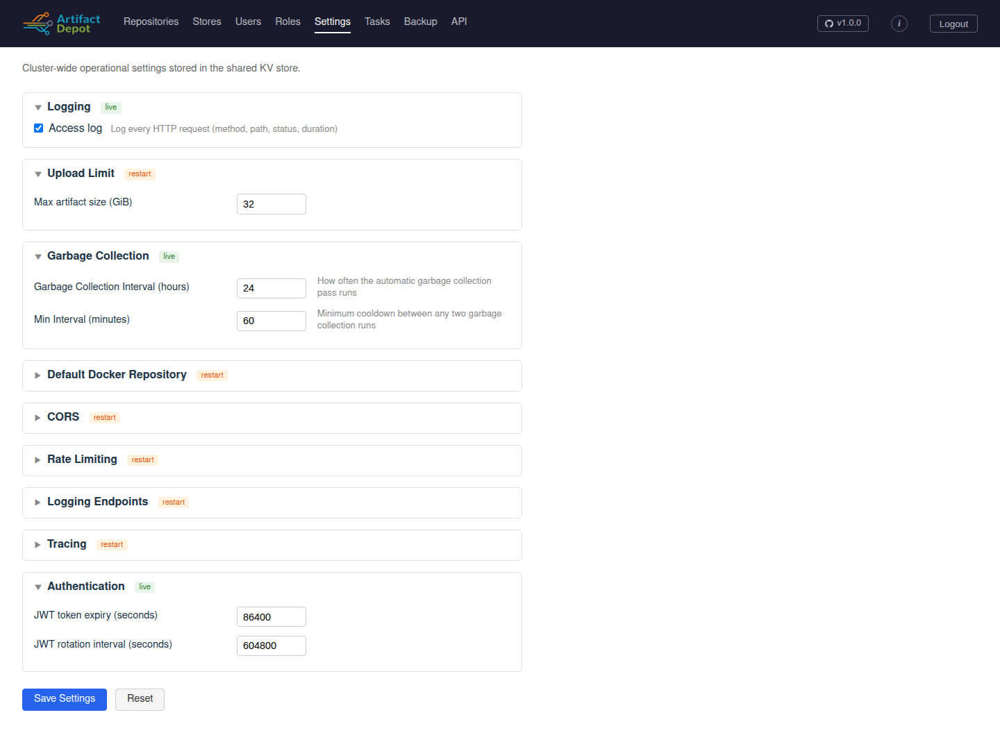</a>
  <a href="screenshots/settings-dark.png" target="_blank">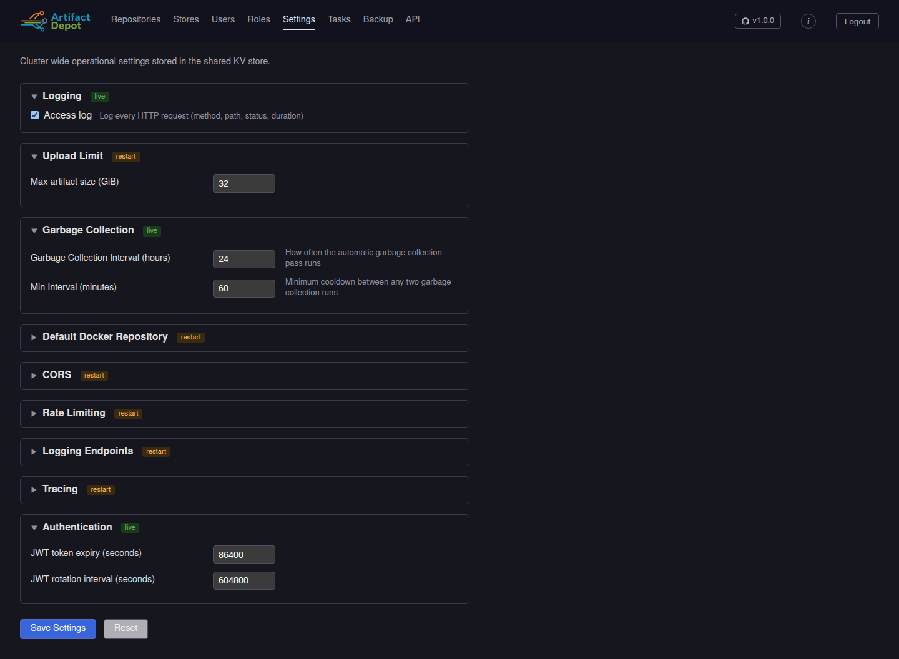</a>

## API documentation

The full OpenAPI spec is rendered in-browser via Swagger UI. Every
endpoint can be expanded to inspect parameters, request bodies,
response schemas, and try-it-now interactively against the live
server.

  
  <a href="screenshots/api-docs-dark.png" target="_blank">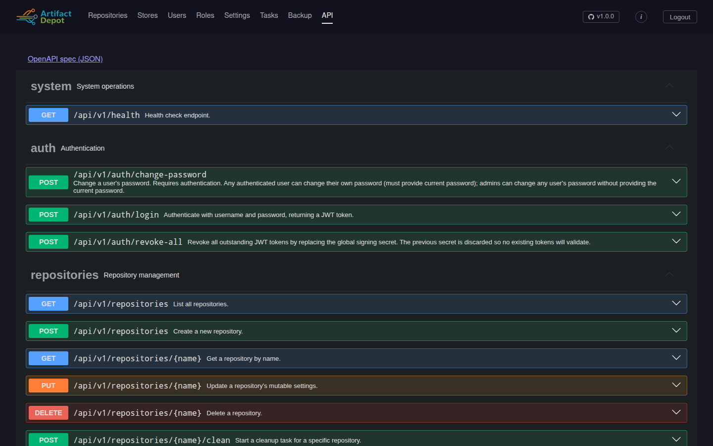</a>

